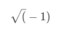

# Han Dance ASE Assignment 

This is an intro to markdown. We use the # 4 headings.

# Sub heading
## Sub sub heading

Paragraphs are on different lines.

So this will work the same as html paragraphs

- This is a list
- so is this
  - and this

1. makes it an ordered list
1. so does this
    1. and this

```C++
printf("this is code\n");
```

$$
\sqrt(-1)
$$

[hyperlinks work like this](https://www.google.co.uk)

Test  This


## Tables
| Heading 1 | Heading A |
|--------|-----------------|
|item 1 | is this |
|item a | is longer|
--------------------------